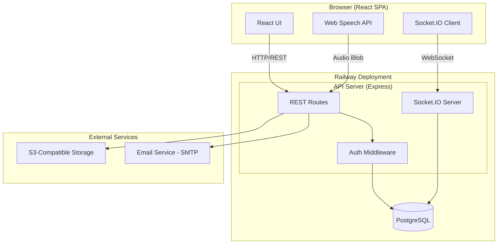
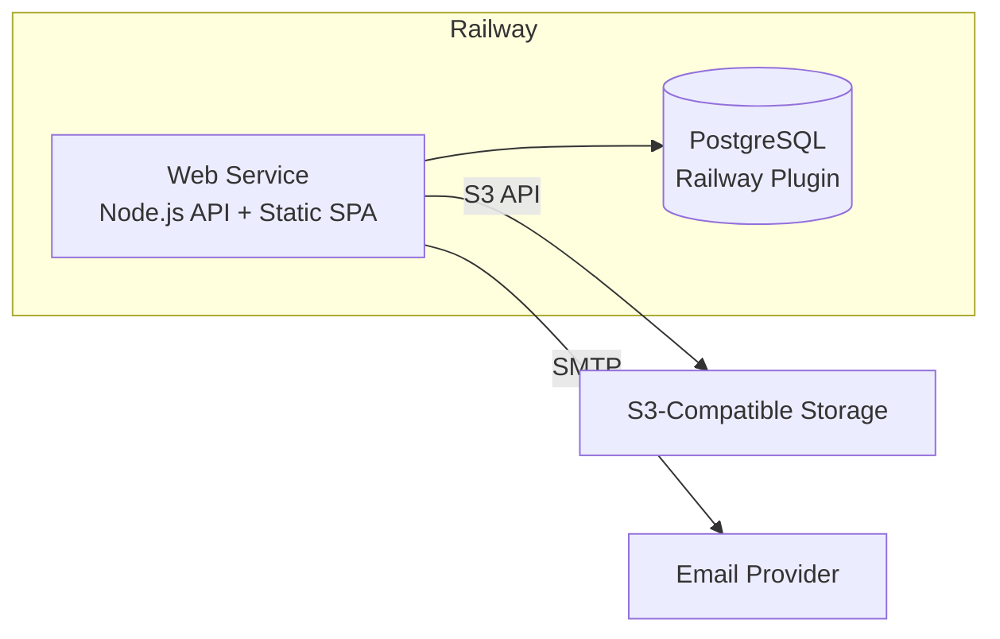
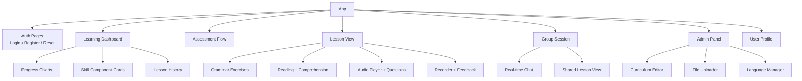
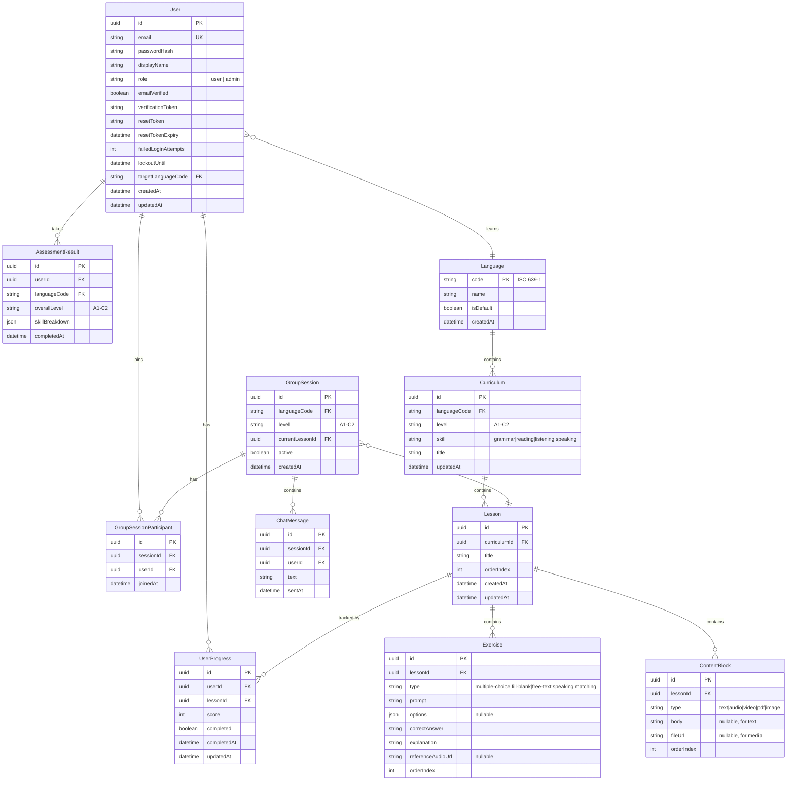

# Design Document: Luxembourgish Learning App

## Overview

This document describes the technical design for a language learning application focused on teaching Luxembourgish. The app provides structured learning across four skill areas (Grammar, Reading, Listening, Speaking), supports proficiency-based content delivery aligned with CEFR levels (A1–C2), and offers solo and group learning modes. The architecture is designed for deployment on Railway and supports future expansion to additional languages.

The system follows a client-server architecture with a React single-page application frontend, a Node.js/Express REST API backend, a PostgreSQL database for structured data, and S3-compatible object storage (via Railway volume or external provider) for curriculum media files. Real-time features (group chat) use WebSockets.

### Key Design Decisions

| Decision | Choice | Rationale |
|---|---|---|
| Frontend Framework | React + TypeScript | Mature ecosystem, strong typing, large community |
| Backend Framework | Node.js + Express + TypeScript | Shared language with frontend, good Railway support |
| Database | PostgreSQL | Relational data model fits curriculum/user structure, Railway native support |
| ORM | Prisma | Type-safe queries, migration support, good DX |
| Authentication | JWT + bcrypt | Stateless auth suitable for Railway deployment, bcrypt for password hashing |
| Real-time | Socket.IO | WebSocket abstraction with fallback, good for group chat |
| File Storage | S3-compatible (Cloudflare R2 or AWS S3) | Curriculum media (audio, video, PDF) needs object storage; Railway volumes are ephemeral |
| Speech Processing | Web Speech API (browser) + server-side comparison | Browser handles recording; server compares against reference |
| Deployment | Railway | User's preferred platform; supports Node.js, PostgreSQL, and environment variables natively |

## Architecture

### High-Level Architecture Diagram



### Deployment Architecture (Railway)



The app deploys as a single Railway web service that serves both the API and the built React SPA as static files. PostgreSQL is provisioned via Railway's built-in plugin. Media files are stored externally in S3-compatible storage since Railway volumes are not persistent across deploys.

## Components and Interfaces

### Backend Components

#### 1. Auth Module (`/api/auth`)

Handles user registration, login, email verification, password reset, and account lockout.

```typescript
// POST /api/auth/register
interface RegisterRequest {
  email: string;
  password: string;
  displayName: string;
}
interface RegisterResponse {
  userId: string;
  message: string; // "Verification email sent"
}

// POST /api/auth/login
interface LoginRequest {
  email: string;
  password: string;
}
interface LoginResponse {
  token: string; // JWT
  user: { id: string; email: string; displayName: string };
}

// POST /api/auth/verify-email
interface VerifyEmailRequest {
  token: string;
}

// POST /api/auth/forgot-password
interface ForgotPasswordRequest {
  email: string;
}

// POST /api/auth/reset-password
interface ResetPasswordRequest {
  token: string;
  newPassword: string;
}
```


#### 2. Assessment Module (`/api/assessments`)

Manages proficiency level assessments across all four skill components.

```typescript
// POST /api/assessments/start
interface StartAssessmentResponse {
  assessmentId: string;
  sections: SkillComponent[]; // ["grammar", "reading", "listening", "speaking"]
}

// POST /api/assessments/:id/submit
interface SubmitAssessmentRequest {
  answers: { questionId: string; answer: string | AudioBlob }[];
}
interface AssessmentResultResponse {
  overallLevel: CEFRLevel;
  skillBreakdown: {
    skill: SkillComponent;
    level: CEFRLevel;
    strengths: string[];
    improvements: string[];
  }[];
}

// PUT /api/users/:id/proficiency
interface SelfSelectLevelRequest {
  level: CEFRLevel;
}

type CEFRLevel = "A1" | "A2" | "B1" | "B2" | "C1" | "C2";
type SkillComponent = "grammar" | "reading" | "listening" | "speaking";
```

#### 3. Curriculum Module (`/api/curriculum`)

Admin-facing CRUD for curriculum content, organized by language, level, and skill.

```typescript
// GET /api/curriculum?language=lb&level=A1&skill=grammar
interface CurriculumListResponse {
  lessons: LessonSummary[];
  total: number;
}

// POST /api/curriculum/lessons (Admin only)
interface CreateLessonRequest {
  targetLanguage: string;
  level: CEFRLevel;
  skill: SkillComponent;
  title: string;
  order: number;
  content: LessonContent;
}

// POST /api/curriculum/upload (Admin only, multipart)
// Accepts: PDF, MP3, WAV, MP4, plain text
// Returns: { fileUrl: string; fileType: string }

// PUT /api/curriculum/lessons/:id (Admin only)
// DELETE /api/curriculum/lessons/:id (Admin only)
// PUT /api/curriculum/lessons/reorder (Admin only)
interface ReorderRequest {
  lessonIds: string[]; // ordered array
}
```

#### 4. Lesson Engine Module (`/api/lessons`)

Serves lesson content to users and handles exercise submissions.

```typescript
// GET /api/lessons/:id
interface LessonDetailResponse {
  id: string;
  title: string;
  skill: SkillComponent;
  level: CEFRLevel;
  instructionalContent: ContentBlock[];
  exercises: Exercise[];
}

// POST /api/lessons/:id/exercises/:exerciseId/submit
interface ExerciseSubmitRequest {
  answer: string | string[]; // text answer or audio reference
}
interface ExerciseSubmitResponse {
  correct: boolean;
  correctAnswer: string;
  explanation: string;
}

// GET /api/lessons/:id/transcript (Listening lessons only)
interface TranscriptResponse {
  text: string;
}

interface ContentBlock {
  type: "text" | "audio" | "video" | "pdf" | "image";
  url?: string;
  body?: string;
}

interface Exercise {
  id: string;
  type: "multiple-choice" | "fill-blank" | "free-text" | "speaking" | "matching";
  prompt: string;
  options?: string[];
  referenceAudioUrl?: string;
}
```

#### 5. Speaking Module (`/api/speaking`)

Handles audio recording uploads and pronunciation comparison.

```typescript
// POST /api/speaking/evaluate
interface SpeakingEvaluateRequest {
  exerciseId: string;
  audioBlob: File; // multipart upload
}
interface SpeakingEvaluateResponse {
  score: number; // 0-100
  feedback: string;
  referenceAudioUrl: string;
}
```

#### 6. Group Learning Module (`/api/groups` + WebSocket)

Manages group sessions and real-time chat.

```typescript
// POST /api/groups/join
interface JoinGroupRequest {
  level: CEFRLevel;
  targetLanguage: string;
}
interface JoinGroupResponse {
  sessionId: string;
  participants: { id: string; displayName: string }[];
  currentLesson: LessonSummary;
}

// WebSocket events (Socket.IO)
// Client -> Server
interface ChatMessage { sessionId: string; text: string; }
// Server -> Client
interface ChatBroadcast { userId: string; displayName: string; text: string; timestamp: string; }
interface ParticipantJoined { userId: string; displayName: string; }
interface ParticipantLeft { userId: string; }
```

#### 7. Progress Module (`/api/progress`)

Tracks and reports user learning progress.

```typescript
// GET /api/progress/dashboard
interface DashboardResponse {
  currentLevel: CEFRLevel;
  targetLanguage: string;
  skills: {
    skill: SkillComponent;
    level: CEFRLevel;
    completedLessons: number;
    totalLessons: number;
    percentComplete: number;
  }[];
}

// GET /api/progress/history?page=1&limit=20
interface ProgressHistoryResponse {
  entries: {
    lessonId: string;
    lessonTitle: string;
    skill: SkillComponent;
    score: number;
    completedAt: string;
  }[];
  total: number;
}

// POST /api/progress/complete (called internally after lesson completion)
interface LessonCompleteRequest {
  lessonId: string;
  score: number;
}
```

#### 8. Language Management Module (`/api/languages`)

Admin-facing module for managing available target languages.

```typescript
// GET /api/languages
interface LanguageListResponse {
  languages: { code: string; name: string; isDefault: boolean }[];
}

// POST /api/languages (Admin only)
interface AddLanguageRequest {
  code: string; // ISO 639-1
  name: string;
}

// PUT /api/users/:id/target-language
interface SwitchLanguageRequest {
  languageCode: string;
}
```

### Frontend Components




## Data Models

### Entity Relationship Diagram



### Prisma Schema (Key Models)

```prisma
model User {
  id                  String    @id @default(uuid())
  email               String    @unique
  passwordHash        String
  displayName         String
  role                Role      @default(USER)
  emailVerified       Boolean   @default(false)
  verificationToken   String?
  resetToken          String?
  resetTokenExpiry    DateTime?
  failedLoginAttempts Int       @default(0)
  lockoutUntil        DateTime?
  targetLanguageCode  String    @default("lb")
  createdAt           DateTime  @default(now())
  updatedAt           DateTime  @updatedAt

  targetLanguage      Language  @relation(fields: [targetLanguageCode], references: [code])
  progress            UserProgress[]
  assessments         AssessmentResult[]
  groupParticipations GroupSessionParticipant[]
  chatMessages        ChatMessage[]
}

enum Role {
  USER
  ADMIN
}

model Language {
  code      String   @id // "lb", "fr", "en"
  name      String
  isDefault Boolean  @default(false)
  createdAt DateTime @default(now())

  users       User[]
  curricula   Curriculum[]
  assessments AssessmentResult[]
  sessions    GroupSession[]
}

model Curriculum {
  id           String        @id @default(uuid())
  languageCode String
  level        String        // "A1" through "C2"
  skill        String        // "grammar", "reading", "listening", "speaking"
  title        String
  updatedAt    DateTime      @updatedAt

  language     Language      @relation(fields: [languageCode], references: [code])
  lessons      Lesson[]

  @@unique([languageCode, level, skill])
}

model Lesson {
  id           String         @id @default(uuid())
  curriculumId String
  title        String
  orderIndex   Int
  createdAt    DateTime       @default(now())
  updatedAt    DateTime       @updatedAt

  curriculum   Curriculum     @relation(fields: [curriculumId], references: [id])
  content      ContentBlock[]
  exercises    Exercise[]
  progress     UserProgress[]
  groupSessions GroupSession[]
}

model Exercise {
  id                String  @id @default(uuid())
  lessonId          String
  type              String  // "multiple-choice", "fill-blank", "free-text", "speaking", "matching"
  prompt            String
  options           Json?
  correctAnswer     String
  explanation       String
  referenceAudioUrl String?
  orderIndex        Int

  lesson            Lesson  @relation(fields: [lessonId], references: [id])
}

model UserProgress {
  id          String    @id @default(uuid())
  userId      String
  lessonId    String
  score       Int
  completed   Boolean   @default(false)
  completedAt DateTime?
  updatedAt   DateTime  @updatedAt

  user        User      @relation(fields: [userId], references: [id])
  lesson      Lesson    @relation(fields: [lessonId], references: [id])

  @@unique([userId, lessonId])
}
```


## Correctness Properties

*A property is a characteristic or behavior that should hold true across all valid executions of a system — essentially, a formal statement about what the system should do. Properties serve as the bridge between human-readable specifications and machine-verifiable correctness guarantees.*

### Property 1: Password hashing invariant

*For any* password provided during registration, the stored password hash must be a valid bcrypt hash, must not equal the plaintext password, and must verify correctly against the original password using bcrypt compare.

**Validates: Requirements 1.7**

### Property 2: Registration input validation

*For any* registration request with invalid data (malformed email, password shorter than minimum length, missing required fields), the system should reject the request and return a validation error message that references each specific invalid field.

**Validates: Requirements 1.3**

### Property 3: Account lockout after failed login attempts

*For any* user account, after exactly 3 consecutive failed login attempts, the account should be locked and subsequent login attempts with correct credentials should be rejected until the lockout period (15 minutes) expires.

**Validates: Requirements 1.5**

### Property 4: Assessment assigns valid CEFR level

*For any* set of completed assessment answers, the system should assign a proficiency level that is one of the six valid CEFR levels (A1, A2, B1, B2, C1, C2) and never return a value outside this set.

**Validates: Requirements 2.3**

### Property 5: Assessment result covers all skill components

*For any* completed assessment, the result should contain a skill breakdown with exactly 4 entries — one for each skill component (grammar, reading, listening, speaking) — each including a valid CEFR level, strengths, and areas for improvement.

**Validates: Requirements 2.4, 2.5**

### Property 6: Curriculum data invariant

*For any* curriculum record in the database, it must have a `level` value that is one of the 6 valid CEFR levels AND a `skill` value that is one of the 4 valid skill components (grammar, reading, listening, speaking).

**Validates: Requirements 3.1, 3.2**

### Property 7: Curriculum upload requires classification

*For any* curriculum upload request that is missing either the target proficiency level or the skill component, the system should reject the request with a validation error.

**Validates: Requirements 3.3**

### Property 8: File format validation

*For any* file upload with a MIME type or extension not in the supported set (PDF, MP3, WAV, MP4, plain text), the system should reject the upload and return a descriptive error message identifying the unsupported format.

**Validates: Requirements 3.5**

### Property 9: Lessons match user proficiency level

*For any* authenticated user with an assigned proficiency level and any skill component, all lessons returned by the lesson listing endpoint should have a CEFR level matching the user's assigned level for that skill.

**Validates: Requirements 4.1, 5.1, 6.1, 7.1**

### Property 10: Lesson structure matches skill type

*For any* lesson, its content and exercises should match its skill type: grammar lessons contain instructional content and interactive exercises; reading lessons contain text passages and comprehension questions; listening lessons contain audio content blocks and comprehension questions; speaking lessons contain prompts with reference audio URLs.

**Validates: Requirements 4.2, 5.2, 6.2, 7.2**

### Property 11: Exercise submission feedback completeness

*For any* exercise submission (across grammar, reading, listening, and speaking skills), the response should include a correctness indicator (boolean), the correct answer, and an explanation string that is non-empty.

**Validates: Requirements 4.3, 5.4, 6.4, 7.3**

### Property 12: Progress tracking round trip

*For any* user and any lesson, after submitting a completion with a score, querying the user's progress should return a record for that lesson with the same score, a completed status of true, and a non-null completion timestamp.

**Validates: Requirements 4.4, 5.5, 6.6, 7.5**

### Property 13: Listening lessons have transcripts

*For any* listening lesson, the transcript endpoint should return a non-empty text string.

**Validates: Requirements 6.3**

### Property 14: Speaking exercises have reference audio

*For any* speaking exercise, the `referenceAudioUrl` field should be a non-null, non-empty string pointing to a valid audio resource.

**Validates: Requirements 7.4**

### Property 15: Group session level matching

*For any* user joining a group session, the session's proficiency level should match the user's current proficiency level for the target language.

**Validates: Requirements 8.3**

### Property 16: Group chat message delivery

*For any* message sent by a participant in a group session, all other active participants in the same session should receive the message with the correct sender information and timestamp.

**Validates: Requirements 8.4**

### Property 17: Dashboard completeness

*For any* authenticated user, the dashboard endpoint should return progress data containing exactly 4 skill entries (grammar, reading, listening, speaking), each with a valid CEFR level and a percentage value between 0 and 100 inclusive.

**Validates: Requirements 9.1, 9.2**

### Property 18: Progress history contains required fields

*For any* entry in a user's progress history, it should contain a lesson title, a numeric score, and a completion date that is a valid ISO timestamp.

**Validates: Requirements 9.4**

### Property 19: Content-language association invariant

*For any* curriculum, lesson, or assessment record in the database, it must be associated with a valid target language code that exists in the languages table.

**Validates: Requirements 10.1**

### Property 20: Adding a language makes it available

*For any* new language added by an admin via the API, the language should immediately appear in the list returned by the languages endpoint and be selectable by users.

**Validates: Requirements 10.3**

### Property 21: Language switch resets dashboard context

*For any* user who switches their target language, the dashboard should reflect progress data for the newly selected language only, and not show progress from the previous language.

**Validates: Requirements 10.5**


## Error Handling

### API Error Response Format

All API errors follow a consistent JSON structure:

```typescript
interface ApiError {
  status: number;       // HTTP status code
  code: string;         // Machine-readable error code, e.g. "INVALID_CREDENTIALS"
  message: string;      // Human-readable message
  details?: Record<string, string>; // Per-field validation errors
}
```

### Error Categories

| Category | HTTP Status | Example Scenarios |
|---|---|---|
| Validation Errors | 400 | Invalid email format, missing required fields, unsupported file format |
| Authentication Errors | 401 | Invalid/expired JWT, incorrect credentials |
| Authorization Errors | 403 | Non-admin accessing admin endpoints, accessing another user's data |
| Not Found | 404 | Lesson not found, user not found |
| Account Locked | 423 | Login attempt on locked account (after 3 failures) |
| Rate Limiting | 429 | Too many requests from same IP |
| File Upload Errors | 413/415 | File too large, unsupported media type |
| Server Errors | 500 | Database connection failure, S3 upload failure |

### Error Handling Strategy by Module

- **Auth Module**: Returns field-specific validation errors for registration. Returns generic "invalid credentials" for login (no user enumeration). Tracks failed attempts and returns lockout status with remaining time.
- **Curriculum Module**: Validates file type before upload. Returns descriptive error for unsupported formats. Validates CEFR level and skill component values against allowed enums.
- **Lesson Engine**: Returns 404 for non-existent lessons. Validates exercise answer format before processing.
- **Speaking Module**: Returns error if audio blob is missing, too large (>10MB), or in unsupported format. Returns graceful degradation message if pronunciation comparison service is unavailable.
- **Group Module**: Returns error if no active session exists for the user's level. Handles WebSocket disconnections gracefully with automatic cleanup of participant lists.
- **Progress Module**: Handles duplicate completion submissions idempotently (upsert on userId+lessonId unique constraint).

### Global Middleware

- **Error boundary middleware**: Catches unhandled errors, logs them, returns sanitized 500 response (no stack traces in production).
- **Request validation middleware**: Uses Zod schemas to validate request bodies, query params, and path params before reaching route handlers.
- **Auth middleware**: Validates JWT on protected routes, returns 401 with clear message on expiry or invalidity.

## Testing Strategy

### Testing Framework and Tools

| Tool | Purpose |
|---|---|
| Vitest | Unit and integration test runner |
| fast-check | Property-based testing library |
| Supertest | HTTP endpoint testing |
| Prisma (test client) | Database testing with test transactions |
| Socket.IO Client | WebSocket integration testing |

### Unit Tests

Unit tests cover specific examples, edge cases, and error conditions:

- **Auth**: Registration with valid/invalid data, login success/failure, lockout trigger at exactly 3 attempts, password reset token generation and expiry, bcrypt hash verification
- **Assessment**: Scoring algorithm with known answer sets, level assignment boundary cases (e.g., borderline A1/A2), self-select level validation
- **Curriculum**: File format validation for each supported/unsupported type, CRUD operations, reorder logic
- **Lesson Engine**: Exercise answer evaluation for each exercise type (multiple-choice, fill-blank, free-text, matching), feedback generation
- **Speaking**: Audio upload validation, pronunciation score calculation with known reference/input pairs
- **Group**: Session creation, participant join/leave, chat message persistence
- **Progress**: Dashboard calculation with various completion states, history pagination, language switch behavior
- **Language**: Adding/removing languages, default language enforcement

### Property-Based Tests

Each correctness property from the design document is implemented as a single property-based test using `fast-check`. All property tests run a minimum of 100 iterations.

Each test is tagged with a comment in the format:
**Feature: luxembourgish-learning-app, Property {number}: {property title}**

Property tests focus on:
- Generating random valid/invalid inputs to verify universal behaviors
- Testing invariants that must hold across all data (CEFR levels, skill components, language associations)
- Round-trip properties (progress tracking: write then read)
- Validation properties (all invalid inputs rejected, all valid inputs accepted)
- Structural properties (response shapes always contain required fields)

### Test Organization

```
tests/
├── unit/
│   ├── auth.test.ts
│   ├── assessment.test.ts
│   ├── curriculum.test.ts
│   ├── lessons.test.ts
│   ├── speaking.test.ts
│   ├── groups.test.ts
│   ├── progress.test.ts
│   └── languages.test.ts
├── properties/
│   ├── auth.properties.test.ts        # Properties 1-3
│   ├── assessment.properties.test.ts  # Properties 4-5
│   ├── curriculum.properties.test.ts  # Properties 6-8
│   ├── lessons.properties.test.ts     # Properties 9-14
│   ├── groups.properties.test.ts      # Properties 15-16
│   ├── progress.properties.test.ts    # Properties 17-18
│   └── languages.properties.test.ts   # Properties 19-21
└── integration/
    ├── auth-flow.test.ts
    ├── lesson-flow.test.ts
    └── group-session.test.ts
```

### Test Configuration

```typescript
// vitest.config.ts
export default defineConfig({
  test: {
    globals: true,
    environment: 'node',
    setupFiles: ['./tests/setup.ts'],
    include: ['tests/**/*.test.ts'],
  },
});
```

Property tests use `fast-check` with a minimum of 100 runs:

```typescript
// Example property test structure
import { fc } from 'fast-check';

// Feature: luxembourgish-learning-app, Property 1: Password hashing invariant
test('Property 1: stored password hash is valid bcrypt and verifies against original', () => {
  fc.assert(
    fc.property(fc.string({ minLength: 8, maxLength: 72 }), async (password) => {
      const hash = await hashPassword(password);
      expect(hash).not.toBe(password);
      expect(await verifyPassword(password, hash)).toBe(true);
    }),
    { numRuns: 100 }
  );
});
```
