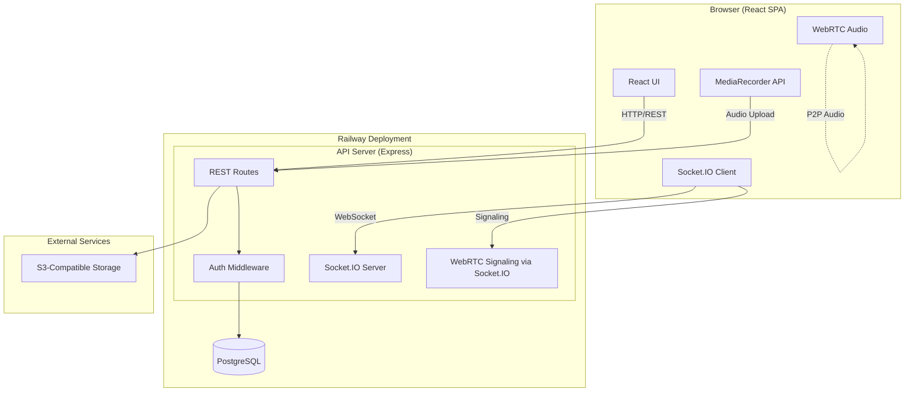
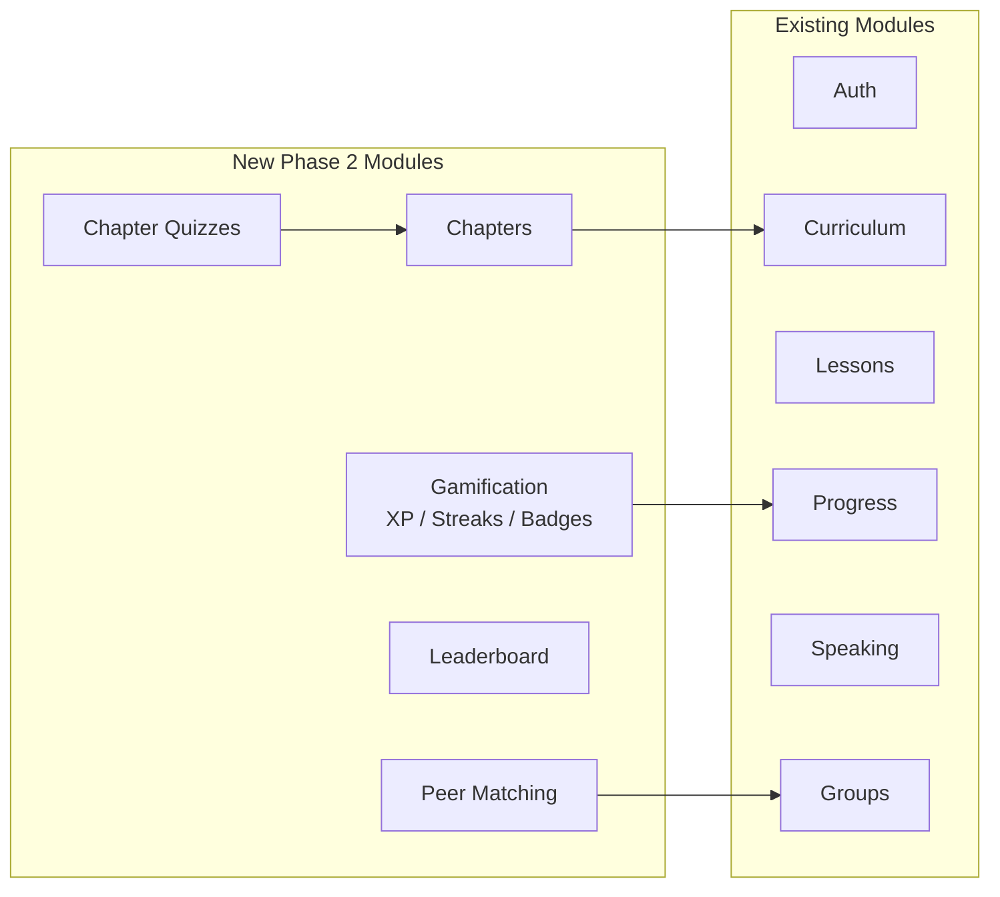
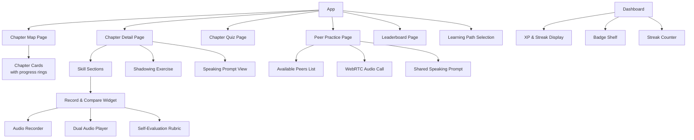
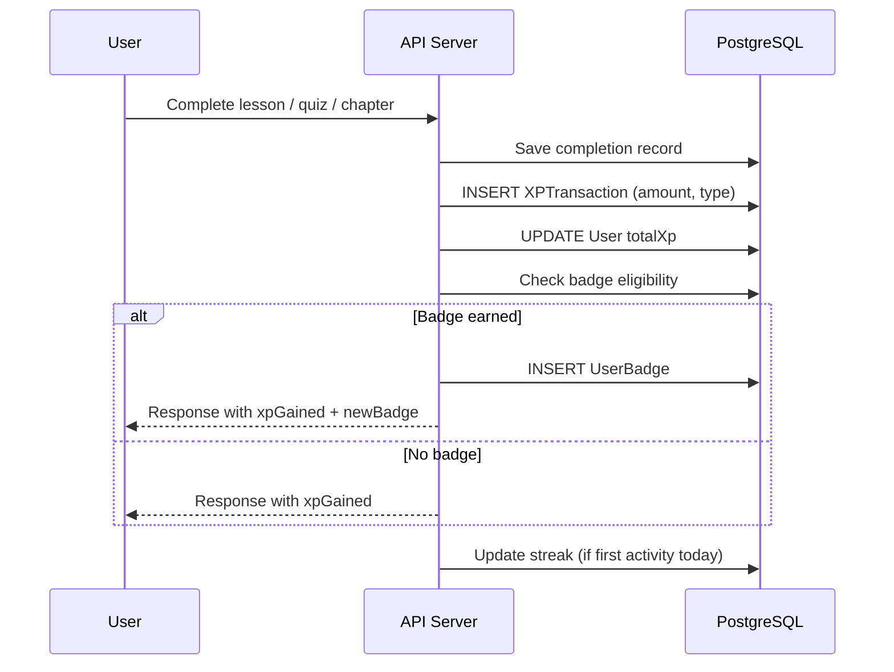

# Design Document: Phase 2 — Enhanced Learning Features

## Overview

This document describes the technical design for Phase 2 of the Reply Luxembourgish learning app. Phase 2 restructures the existing skill-based curriculum into a chapter-based learning system, introduces two learning paths (Sproochentest Preparation and Daily Life), adds chapter quizzes, enhanced speaking practice (record & compare, shadowing, peer-to-peer), gamification (XP, streaks, badges), a leaderboard, and admin material upload tools.

The design extends the existing architecture: React + TypeScript frontend (Vite), Node.js + Express + TypeScript backend, PostgreSQL via Prisma ORM, Socket.IO for real-time features, S3-compatible storage for media, deployed on Railway.

### Key Design Decisions

| Decision | Choice | Rationale |
|---|---|---|
| Peer Audio | WebRTC with Socket.IO signaling | Direct peer-to-peer audio avoids media server costs; Socket.IO already in use for signaling |
| Speaking Evaluation | Self-evaluation rubric (no STT) | Avoids unreliable speech-to-text for Luxembourgish; rubric gives structured self-assessment |
| XP Calculation | Server-side event-driven | All XP awards happen server-side on activity completion to prevent client manipulation |
| Streak Tracking | Server-side daily check with timezone | Streak logic runs on lesson completion; uses UTC calendar days for consistency |
| Leaderboard | Materialized query with caching | Query XP aggregates on demand with short TTL cache; avoids complex materialized views for Railway PostgreSQL |
| Chapter Locking | Sequential unlock via server validation | Server enforces chapter ordering; client displays lock state but server is source of truth |
| Badge System | Event-driven checks on XP/streak/completion events | Badge eligibility checked after each relevant event; awarded once and stored |

## Architecture

### High-Level Architecture (Phase 2 Additions)



### New Backend Modules



## Components and Interfaces

### 1. Chapters Module (`/api/chapters`)

Manages chapter-based curriculum structure. Chapters group existing lessons by topic and enforce sequential progression.

```typescript
// GET /api/chapters?level=A1&path=sproochentest
interface ChapterListResponse {
  chapters: ChapterSummary[];
}
interface ChapterSummary {
  id: string;
  title: string;
  description: string;
  orderIndex: number;
  level: string;
  learningPath: 'sproochentest' | 'daily_life';
  status: 'locked' | 'in_progress' | 'completed';
  progress: {
    grammar: number;   // 0-100 percent
    reading: number;
    listening: number;
    speaking: number;
  };
  quizPassed: boolean;
}

// GET /api/chapters/:id
interface ChapterDetailResponse {
  id: string;
  title: string;
  description: string;
  level: string;
  learningPath: string;
  sections: {
    skill: 'grammar' | 'reading' | 'listening' | 'speaking';
    lessons: LessonSummary[];
    completedCount: number;
    totalCount: number;
  }[];
  speakingPrompts: SpeakingPromptSummary[];
  shadowingExercises: ShadowingExerciseSummary[];
  quizUnlocked: boolean;
  quizPassed: boolean;
}

// POST /api/chapters (Admin only)
interface CreateChapterRequest {
  title: string;
  description: string;
  level: string;
  learningPath: 'sproochentest' | 'daily_life';
  orderIndex: number;
}

// PUT /api/chapters/:id (Admin only)
// DELETE /api/chapters/:id (Admin only)
```

### 2. Chapter Quizzes Module (`/api/chapters/:chapterId/quiz`)

Handles end-of-chapter quizzes that test all four skill components.

```typescript
// GET /api/chapters/:chapterId/quiz
interface ChapterQuizResponse {
  quizId: string;
  chapterId: string;
  questions: QuizQuestion[];
}
interface QuizQuestion {
  id: string;
  skill: 'grammar' | 'reading' | 'listening' | 'speaking';
  type: 'multiple-choice' | 'fill-blank' | 'listening-comprehension' | 'speaking-prompt';
  prompt: string;
  options?: string[];
  audioUrl?: string;
  referenceAudioUrl?: string;
}

// POST /api/chapters/:chapterId/quiz/submit
interface QuizSubmitRequest {
  answers: { questionId: string; answer: string }[];
}
interface QuizResultResponse {
  score: number;           // 0-100 percentage
  passed: boolean;         // score >= 70
  attempts: number;
  highestScore: number;
  breakdown: {
    skill: string;
    correct: number;
    total: number;
  }[];
  incorrectAnswers: {
    questionId: string;
    userAnswer: string;
    correctAnswer: string;
    explanation: string;
  }[];
}

// GET /api/chapters/:chapterId/quiz/results
interface QuizHistoryResponse {
  attempts: {
    attemptNumber: number;
    score: number;
    passed: boolean;
    completedAt: string;
  }[];
  highestScore: number;
}
```

### 3. Gamification Module (`/api/gamification`)

Manages XP, streaks, and badges. XP is awarded server-side on activity completion events.

```typescript
// GET /api/gamification/summary
interface GamificationSummaryResponse {
  totalXp: number;
  currentStreak: number;
  longestStreak: number;
  badges: UserBadge[];
  recentXpGains: XPTransaction[];
}

// GET /api/gamification/xp/history?page=1&limit=20
interface XPHistoryResponse {
  transactions: XPTransaction[];
  total: number;
}
interface XPTransaction {
  id: string;
  amount: number;
  activityType: 'lesson_completion' | 'quiz_pass' | 'chapter_completion';
  description: string;
  createdAt: string;
}

// GET /api/gamification/badges
interface BadgeListResponse {
  earned: UserBadge[];
  locked: LockedBadge[];
}
interface UserBadge {
  id: string;
  badgeKey: string;
  name: string;
  description: string;
  iconUrl: string;
  earnedAt: string;
}
interface LockedBadge {
  badgeKey: string;
  name: string;
  description: string;
  iconUrl: string;
  criteria: string;
}

// GET /api/gamification/streak
interface StreakResponse {
  currentStreak: number;
  longestStreak: number;
  lastActivityDate: string | null;
}
```

### 4. Leaderboard Module (`/api/leaderboard`)

```typescript
// GET /api/leaderboard?period=weekly|monthly|all_time&limit=50
interface LeaderboardResponse {
  entries: LeaderboardEntry[];
  userRank: {
    rank: number;
    totalXp: number;
  } | null;
  period: 'weekly' | 'monthly' | 'all_time';
}
interface LeaderboardEntry {
  rank: number;
  userId: string;
  displayName: string;
  totalXp: number;
  currentStreak: number;
  badgeCount: number;
}
```

### 5. Peer Matching Module (`/api/peers`)

Manages peer-to-peer speaking practice matching and WebRTC signaling.

```typescript
// GET /api/peers/available?level=A2
interface AvailablePeersResponse {
  peers: {
    userId: string;
    displayName: string;
    level: string;
    availableSince: string;
  }[];
  totalAvailable: number;
}

// POST /api/peers/invite
interface PeerInviteRequest {
  targetUserId: string;
}
interface PeerInviteResponse {
  invitationId: string;
  expiresAt: string; // 2 minutes from now
}

// POST /api/peers/invite/:invitationId/accept
interface PeerAcceptResponse {
  sessionId: string;
  prompt: SpeakingPromptSummary;
}

// PUT /api/peers/availability
interface SetAvailabilityRequest {
  status: 'available' | 'busy' | 'offline';
}

// POST /api/peers/sessions/:sessionId/end
// Ends the session and prompts self-evaluation

// WebSocket events for peer sessions (via Socket.IO)
// Client -> Server
interface PeerSignal {
  sessionId: string;
  signal: RTCSessionDescriptionInit | RTCIceCandidateInit;
  type: 'offer' | 'answer' | 'ice-candidate';
}
// Server -> Client
interface PeerInvitation {
  invitationId: string;
  fromUserId: string;
  fromDisplayName: string;
  prompt: SpeakingPromptSummary;
}
interface PeerSessionStarted {
  sessionId: string;
  peerId: string;
  peerDisplayName: string;
  prompt: SpeakingPromptSummary;
}
interface PeerSignalRelay {
  signal: RTCSessionDescriptionInit | RTCIceCandidateInit;
  type: 'offer' | 'answer' | 'ice-candidate';
}
```

### 6. Enhanced Speaking Module (extensions to `/api/speaking`)

```typescript
// POST /api/speaking/record
interface SpeakingRecordRequest {
  exerciseId: string;
  audioBlob: File; // multipart
}
interface SpeakingRecordResponse {
  attemptId: string;
  recordingUrl: string;
  referenceAudioUrl: string;
}

// POST /api/speaking/self-evaluate
interface SelfEvaluateRequest {
  attemptId: string;
  scores: {
    pronunciation: number;  // 1-5
    fluency: number;        // 1-5
    vocabulary: number;     // 1-5
    grammarAccuracy: number; // 1-5
  };
}

// GET /api/speaking/shadowing/:exerciseId
interface ShadowingExerciseResponse {
  id: string;
  nativeAudioUrl: string;
  transcript: string;
  availableSpeeds: number[]; // [0.5, 0.75, 1.0, 1.25]
}

// POST /api/speaking/shadowing/:exerciseId/attempt
interface ShadowingAttemptRequest {
  audioBlob: File; // multipart
  playbackSpeed: number;
}
interface ShadowingAttemptResponse {
  attemptId: string;
  recordingUrl: string;
  nativeAudioUrl: string;
  attemptNumber: number;
}
```

### 7. Admin Material Upload (extensions to `/api/curriculum`)

```typescript
// POST /api/curriculum/chapters/:chapterId/upload (Admin only, multipart)
interface ChapterMaterialUploadRequest {
  skill: 'grammar' | 'reading' | 'listening' | 'speaking';
  files: File[];  // PDF, MP3, WAV, plain text
}
interface ChapterMaterialUploadResponse {
  uploadedFiles: {
    fileUrl: string;
    fileType: string;
    originalName: string;
  }[];
}

// PUT /api/curriculum/chapters/:chapterId/materials/reorder (Admin only)
interface ReorderMaterialsRequest {
  contentBlockIds: string[];
}

// DELETE /api/curriculum/chapters/:chapterId/materials/:contentBlockId (Admin only)
```

### Frontend Components (Phase 2 Additions)



### WebRTC Peer-to-Peer Audio Flow

```mermaid
sequenceDiagram
    participant A as User A (Caller)
    participant S as Socket.IO Server
    participant B as User B (Callee)

    A->>S: POST /api/peers/invite {targetUserId}
    S->>B: peer:invitation {invitationId, fromUser, prompt}
    B->>S: POST /api/peers/invite/:id/accept
    S->>A: peer:session-started {sessionId, peerId}
    S->>B: peer:session-started {sessionId, peerId}

    Note over A,B: WebRTC Signaling via Socket.IO
    A->>S: peer:signal {offer}
    S->>B: peer:signal {offer}
    B->>S: peer:signal {answer}
    S->>A: peer:signal {answer}
    A->>S: peer:signal {ice-candidate}
    S->>B: peer:signal {ice-candidate}
    B->>S: peer:signal {ice-candidate}
    S->>A: peer:signal {ice-candidate}

    Note over A,B: Direct P2P Audio Stream
    A<-->B: WebRTC Audio

    A->>S: POST /api/peers/sessions/:id/end
    S->>B: peer:session-ended
    Note over A,B: Both prompted for self-evaluation
```

### XP Award Flow



## Data Models

### New Prisma Models (extending existing schema)

```mermaid
erDiagram
    User ||--o{ XPTransaction : earns
    User ||--o{ UserBadge : earns
    User ||--o{ Streak : has
    User ||--o{ SpeakingAttempt : records
    User ||--o{ PeerSession : "participates in"
    User ||--o{ ChapterProgress : tracks
    User ||--o{ QuizAttempt : takes

    Chapter ||--o{ ChapterLesson : contains
    Chapter ||--o{ ChapterQuiz : has
    Chapter ||--o{ SpeakingPrompt : has
    Chapter ||--o{ ShadowingExercise : has
    Chapter ||--o{ ChapterProgress : "tracked by"

    ChapterQuiz ||--o{ QuizQuestion : contains
    ChapterQuiz ||--o{ QuizAttempt : "attempted by"

    Lesson ||--o{ ChapterLesson : "belongs to"

    PeerSession ||--o{ PeerSessionParticipant : has

    Badge ||--o{ UserBadge : "awarded as"

    Chapter {
        uuid id PK
        string title
        string description
        string level "A1-C2"
        string learningPath "sproochentest | daily_life"
        int orderIndex
        boolean published
        datetime createdAt
        datetime updatedAt
    }

    ChapterLesson {
        uuid id PK
        uuid chapterId FK
        uuid lessonId FK
        string skill "grammar|reading|listening|speaking"
        int orderIndex
    }

    ChapterQuiz {
        uuid id PK
        uuid chapterId FK
        int passingScore "default 70"
        datetime createdAt
    }

    QuizQuestion {
        uuid id PK
        uuid quizId FK
        string skill
        string type
        string prompt
        json options
        string correctAnswer
        string explanation
        string audioUrl
        string referenceAudioUrl
        int orderIndex
    }

    QuizAttempt {
        uuid id PK
        uuid quizId FK
        uuid userId FK
        int score
        boolean passed
        json answers
        datetime completedAt
    }

    ChapterProgress {
        uuid id PK
        uuid userId FK
        uuid chapterId FK
        int grammarPercent
        int readingPercent
        int listeningPercent
        int speakingPercent
        boolean allSectionsComplete
        boolean quizPassed
        datetime updatedAt
    }

    SpeakingPrompt {
        uuid id PK
        uuid chapterId FK
        string topic
        string suggestedVocabulary
        json guidingQuestions
        string difficulty "easy|medium|hard"
        string learningPath
    }

    ShadowingExercise {
        uuid id PK
        uuid chapterId FK
        string nativeAudioUrl
        string transcript
        int orderIndex
    }

    SpeakingAttempt {
        uuid id PK
        uuid userId FK
        uuid exerciseId FK
        string exerciseType "speaking|shadowing|peer"
        string recordingUrl
        int pronunciationScore
        int fluencyScore
        int vocabularyScore
        int grammarAccuracyScore
        float playbackSpeed
        datetime createdAt
    }

    XPTransaction {
        uuid id PK
        uuid userId FK
        int amount
        string activityType "lesson_completion|quiz_pass|chapter_completion"
        string description
        datetime createdAt
    }

    Streak {
        uuid id PK
        uuid userId FK
        int currentStreak
        int longestStreak
        date lastActivityDate
        datetime updatedAt
    }

    Badge {
        uuid id PK
        string key UK
        string name
        string description
        string iconUrl
        string criteria
    }

    UserBadge {
        uuid id PK
        uuid userId FK
        uuid badgeId FK
        datetime earnedAt
    }

    PeerSession {
        uuid id PK
        uuid promptId FK
        string status "pending|active|completed|cancelled"
        datetime startedAt
        datetime endedAt
    }

    PeerSessionParticipant {
        uuid id PK
        uuid sessionId FK
        uuid userId FK
        string role "initiator|invitee"
        datetime joinedAt
    }

    PeerAvailability {
        uuid id PK
        uuid userId FK
        string status "available|busy|offline"
        datetime updatedAt
    }
```



### Prisma Schema Additions

```prisma
// --- Learning Path on User ---
// Add to existing User model:
// learningPath  String?  // 'sproochentest' | 'daily_life'

model Chapter {
  id           String   @id @default(uuid())
  title        String
  description  String
  level        String   // "A1" through "C2"
  learningPath String   // "sproochentest" | "daily_life"
  orderIndex   Int
  published    Boolean  @default(false)
  createdAt    DateTime @default(now())
  updatedAt    DateTime @updatedAt

  lessons           ChapterLesson[]
  quiz              ChapterQuiz?
  speakingPrompts   SpeakingPrompt[]
  shadowingExercises ShadowingExercise[]
  progress          ChapterProgress[]

  @@unique([level, learningPath, orderIndex])
}

model ChapterLesson {
  id         String @id @default(uuid())
  chapterId  String
  lessonId   String
  skill      String // "grammar" | "reading" | "listening" | "speaking"
  orderIndex Int

  chapter Chapter @relation(fields: [chapterId], references: [id], onDelete: Cascade)
  lesson  Lesson  @relation(fields: [lessonId], references: [id])

  @@unique([chapterId, lessonId])
}

model ChapterQuiz {
  id           String @id @default(uuid())
  chapterId    String @unique
  passingScore Int    @default(70)
  createdAt    DateTime @default(now())

  chapter   Chapter        @relation(fields: [chapterId], references: [id], onDelete: Cascade)
  questions QuizQuestion[]
  attempts  QuizAttempt[]
}

model QuizQuestion {
  id                String  @id @default(uuid())
  quizId            String
  skill             String
  type              String
  prompt            String
  options           Json?
  correctAnswer     String
  explanation       String
  audioUrl          String?
  referenceAudioUrl String?
  orderIndex        Int

  quiz ChapterQuiz @relation(fields: [quizId], references: [id], onDelete: Cascade)
}

model QuizAttempt {
  id          String   @id @default(uuid())
  quizId      String
  userId      String
  score       Int
  passed      Boolean
  answers     Json
  completedAt DateTime @default(now())

  quiz ChapterQuiz @relation(fields: [quizId], references: [id], onDelete: Cascade)
  user User        @relation(fields: [userId], references: [id])
}

model ChapterProgress {
  id                  String   @id @default(uuid())
  userId              String
  chapterId           String
  grammarPercent      Int      @default(0)
  readingPercent      Int      @default(0)
  listeningPercent    Int      @default(0)
  speakingPercent     Int      @default(0)
  allSectionsComplete Boolean  @default(false)
  quizPassed          Boolean  @default(false)
  updatedAt           DateTime @updatedAt

  user    User    @relation(fields: [userId], references: [id])
  chapter Chapter @relation(fields: [chapterId], references: [id], onDelete: Cascade)

  @@unique([userId, chapterId])
}

model SpeakingPrompt {
  id                  String @id @default(uuid())
  chapterId           String
  topic               String
  suggestedVocabulary String
  guidingQuestions    Json
  difficulty          String // "easy" | "medium" | "hard"
  learningPath        String // "sproochentest" | "daily_life"

  chapter      Chapter       @relation(fields: [chapterId], references: [id], onDelete: Cascade)
  peerSessions PeerSession[]
}

model ShadowingExercise {
  id             String @id @default(uuid())
  chapterId      String
  nativeAudioUrl String
  transcript     String
  orderIndex     Int

  chapter Chapter @relation(fields: [chapterId], references: [id], onDelete: Cascade)
}

model SpeakingAttempt {
  id                   String   @id @default(uuid())
  userId               String
  exerciseId           String
  exerciseType         String   // "speaking" | "shadowing" | "peer"
  recordingUrl         String
  pronunciationScore   Int?
  fluencyScore         Int?
  vocabularyScore      Int?
  grammarAccuracyScore Int?
  playbackSpeed        Float?
  createdAt            DateTime @default(now())

  user User @relation(fields: [userId], references: [id])
}

model XPTransaction {
  id           String   @id @default(uuid())
  userId       String
  amount       Int
  activityType String   // "lesson_completion" | "quiz_pass" | "chapter_completion"
  description  String
  createdAt    DateTime @default(now())

  user User @relation(fields: [userId], references: [id])
}

model Streak {
  id               String   @id @default(uuid())
  userId           String   @unique
  currentStreak    Int      @default(0)
  longestStreak    Int      @default(0)
  lastActivityDate DateTime?
  updatedAt        DateTime @updatedAt

  user User @relation(fields: [userId], references: [id])
}

model Badge {
  id          String @id @default(uuid())
  key         String @unique
  name        String
  description String
  iconUrl     String
  criteria    String

  userBadges UserBadge[]
}

model UserBadge {
  id       String   @id @default(uuid())
  userId   String
  badgeId  String
  earnedAt DateTime @default(now())

  user  User  @relation(fields: [userId], references: [id])
  badge Badge @relation(fields: [badgeId], references: [id])

  @@unique([userId, badgeId])
}

model PeerSession {
  id        String   @id @default(uuid())
  promptId  String?
  status    String   @default("pending") // "pending" | "active" | "completed" | "cancelled"
  startedAt DateTime?
  endedAt   DateTime?

  prompt       SpeakingPrompt?          @relation(fields: [promptId], references: [id])
  participants PeerSessionParticipant[]
}

model PeerSessionParticipant {
  id        String   @id @default(uuid())
  sessionId String
  userId    String
  role      String   // "initiator" | "invitee"
  joinedAt  DateTime @default(now())

  session PeerSession @relation(fields: [sessionId], references: [id], onDelete: Cascade)
  user    User        @relation(fields: [userId], references: [id])

  @@unique([sessionId, userId])
}

model PeerAvailability {
  id        String   @id @default(uuid())
  userId    String   @unique
  status    String   @default("offline") // "available" | "busy" | "offline"
  updatedAt DateTime @updatedAt

  user User @relation(fields: [userId], references: [id])
}
```

### User Model Extensions

The existing `User` model needs these additional fields and relations:

```prisma
// Add to User model:
learningPath          String?   // "sproochentest" | "daily_life"
totalXp               Int       @default(0)

// Add relations:
quizAttempts          QuizAttempt[]
chapterProgress       ChapterProgress[]
speakingAttempts      SpeakingAttempt[]
xpTransactions        XPTransaction[]
streak                Streak?
badges                UserBadge[]
peerParticipations    PeerSessionParticipant[]
peerAvailability      PeerAvailability?
```

### Lesson Model Extension

```prisma
// Add relation to existing Lesson model:
chapterLessons ChapterLesson[]
```


## Correctness Properties

*A property is a characteristic or behavior that should hold true across all valid executions of a system — essentially, a formal statement about what the system should do. Properties serve as the bridge between human-readable specifications and machine-verifiable correctness guarantees.*

### Property 1: Chapter structure invariant

*For any* chapter in the system, the chapter detail response must contain exactly 4 skill sections (grammar, reading, listening, speaking), each with a list of lessons and completion counts.

**Validates: Requirements 1.1, 1.3**

### Property 2: Chapter sequential ordering

*For any* list of chapters returned for a given proficiency level and learning path, the chapters must be sorted in ascending order by `orderIndex`, with no duplicate indices.

**Validates: Requirements 1.2**

### Property 3: Skill completion independence

*For any* chapter progress record, updating the completion percentage of one skill component must not change the completion percentage of any other skill component.

**Validates: Requirements 1.4**

### Property 4: Chapter completion derived from skill completion

*For any* chapter progress record, the `allSectionsComplete` flag must be `true` if and only if all four skill percentages (grammar, reading, listening, speaking) are 100%.

**Validates: Requirements 1.5**

### Property 5: Chapter progress percentages are bounded

*For any* chapter progress record, each skill percentage (grammar, reading, listening, speaking) must be an integer between 0 and 100 inclusive.

**Validates: Requirements 1.6, 13.2**

### Property 6: Chapter sequential locking

*For any* user, proficiency level, and learning path, if chapter at orderIndex N has `quizPassed = false`, then all chapters at orderIndex > N must have status `locked`.

**Validates: Requirements 1.7**

### Property 7: Learning path storage round trip

*For any* valid learning path value ('sproochentest' or 'daily_life'), storing it on a user profile and then reading the profile back must return the same learning path value.

**Validates: Requirements 2.2**

### Property 8: Chapters filtered by learning path

*For any* user with a selected learning path, all chapters returned by the chapters listing endpoint must have a `learningPath` value matching the user's selected learning path.

**Validates: Requirements 2.3, 2.4**

### Property 9: Learning path switch preserves previous progress

*For any* user who switches learning path, all chapter progress records associated with the previous learning path must remain unchanged after the switch.

**Validates: Requirements 2.6**

### Property 10: Sproochentest exercises include required formats

*For any* chapter in the Sproochentest learning path, the exercises must include at least one oral production type (speaking prompt with topic card) and at least one listening comprehension type.

**Validates: Requirements 3.1**

### Property 11: Mock exam score breakdown completeness

*For any* completed mock Sproochentest exam, the result must contain a score breakdown with exactly 2 sections (oral production and listening comprehension), each with a numeric score and feedback text.

**Validates: Requirements 3.6**

### Property 12: Quiz unlock requires all sections complete

*For any* chapter, the quiz must be accessible (unlocked) if and only if the chapter's `allSectionsComplete` flag is `true`.

**Validates: Requirements 4.1**

### Property 13: Quiz covers all four skill components

*For any* chapter quiz, the set of questions must include at least one question for each of the four skill components (grammar, reading, listening, speaking).

**Validates: Requirements 4.2**

### Property 14: Quiz score calculation

*For any* set of quiz answers, the score must equal `(number of correct answers / total number of questions) * 100`, rounded to the nearest integer, and must be between 0 and 100 inclusive.

**Validates: Requirements 4.3**

### Property 15: Quiz pass threshold

*For any* quiz attempt, the `passed` flag must be `true` if and only if the score is greater than or equal to 70.

**Validates: Requirements 4.4, 4.5**

### Property 16: Quiz highest score tracking

*For any* user and chapter quiz, the stored `highestScore` must equal the maximum score across all of that user's attempts, and the attempt count must equal the total number of QuizAttempt records for that user and quiz.

**Validates: Requirements 4.6**

### Property 17: Quiz result skill breakdown

*For any* quiz result response, the breakdown must contain one entry per skill component present in the quiz, each with `correct` and `total` counts where `correct <= total`.

**Validates: Requirements 4.7**

### Property 18: Speaking attempt storage round trip

*For any* speaking or shadowing exercise, when a user uploads an audio recording, a SpeakingAttempt record must be created with a valid `recordingUrl` and the correct `exerciseId`, and querying attempts for that user and exercise must return the stored record.

**Validates: Requirements 5.2, 5.6, 6.6**

### Property 19: Self-evaluation score validation

*For any* self-evaluation submission, each score (pronunciation, fluency, vocabulary, grammarAccuracy) must be an integer between 1 and 5 inclusive. Submissions with scores outside this range must be rejected.

**Validates: Requirements 5.5, 6.5**

### Property 20: Shadowing exercise playback speeds

*For any* shadowing exercise, the available playback speeds must be exactly [0.5, 0.75, 1.0, 1.25].

**Validates: Requirements 6.4**

### Property 21: Peer availability filtering by level

*For any* peer availability query for a given proficiency level, all returned users must have the same proficiency level as the requesting user and must have availability status 'available'.

**Validates: Requirements 7.1, 7.2, 7.5, 15.1**

### Property 22: Peer session creation on acceptance

*For any* accepted peer invitation, a PeerSession must be created with status 'active', exactly 2 PeerSessionParticipant records (one initiator, one invitee), and a non-null prompt reference.

**Validates: Requirements 7.3, 15.3**

### Property 23: Peer availability status validation

*For any* availability status update, the status must be one of 'available', 'busy', or 'offline'. Updates with invalid values must be rejected.

**Validates: Requirements 7.6**

### Property 24: Active peer session sets busy status

*For any* user who is a participant in a PeerSession with status 'active', their PeerAvailability status must be 'busy'.

**Validates: Requirements 15.5**

### Property 25: Speaking prompt required fields

*For any* speaking prompt, it must have a non-empty `topic`, non-empty `suggestedVocabulary`, a non-empty `guidingQuestions` array, and a valid `difficulty` value ('easy', 'medium', or 'hard').

**Validates: Requirements 8.2, 8.3**

### Property 26: Admin upload requires classification

*For any* admin material upload request that is missing the target proficiency level, chapter ID, or skill component, the system must reject the request with a validation error.

**Validates: Requirements 9.2**

### Property 27: File format validation for uploads

*For any* file upload with a MIME type not in the supported set (application/pdf, audio/mpeg, audio/wav, text/plain), the system must reject the upload and return an error identifying the unsupported format.

**Validates: Requirements 9.3, 9.5**

### Property 28: XP award amounts by activity type

*For any* activity completion, the XP awarded must be exactly: 10 for lesson_completion, 25 for quiz_pass, 50 for chapter_completion. No other amounts are valid for these activity types.

**Validates: Requirements 10.1**

### Property 29: Total XP equals sum of transactions

*For any* user, the `totalXp` field must equal the sum of all `amount` values in that user's XPTransaction records.

**Validates: Requirements 10.2**

### Property 30: XP transaction required fields

*For any* XP transaction record, it must have a non-null `activityType` (one of the valid types), a positive integer `amount`, and a valid `createdAt` timestamp.

**Validates: Requirements 10.4**

### Property 31: Streak increment on daily activity

*For any* user completing their first learning activity on a new calendar day (UTC), the streak `currentStreak` must increase by exactly 1 compared to its value before the activity.

**Validates: Requirements 11.1**

### Property 32: Streak reset on missed day

*For any* user whose `lastActivityDate` is more than 1 calendar day (UTC) before the current date, the `currentStreak` must be 0 when next checked.

**Validates: Requirements 11.2**

### Property 33: Longest streak invariant

*For any* user's Streak record, `longestStreak` must be greater than or equal to `currentStreak` at all times.

**Validates: Requirements 11.4**

### Property 34: Streak milestone badges

*For any* user whose `currentStreak` reaches exactly 7, 30, or 100, the system must award the corresponding streak badge, and the badge must appear in the user's earned badges.

**Validates: Requirements 11.5**

### Property 35: Badge milestone awarding

*For any* milestone event (first chapter completed, first quiz passed, 500 XP reached, 1000 XP reached, all chapters in a level completed, streak milestones), the corresponding badge must be awarded exactly once to the user.

**Validates: Requirements 12.1**

### Property 36: Badge list completeness

*For any* user, the badge endpoint must return all earned badges (with earnedAt timestamps) and all unearned badges (with unlock criteria descriptions), and the union of earned and unearned badges must equal the total set of defined badges.

**Validates: Requirements 12.3, 12.4**

### Property 37: Dashboard summary completeness

*For any* authenticated user, the dashboard/gamification summary must include: current proficiency level, total XP, current streak, longest streak, and badge count.

**Validates: Requirements 10.2, 13.3**

### Property 38: Chapter status consistency

*For any* chapter in a chapter list response, the `status` field must be one of 'completed', 'in_progress', or 'locked', and must be consistent with the chapter's progress data: 'completed' if quizPassed is true, 'in_progress' if the chapter is the current unlocked chapter, 'locked' otherwise.

**Validates: Requirements 13.1**

### Property 39: Leaderboard sorted by XP descending

*For any* leaderboard response, the entries must be sorted by `totalXp` in strictly non-increasing order.

**Validates: Requirements 14.1**

### Property 40: Leaderboard period filtering

*For any* leaderboard query with a valid period ('weekly', 'monthly', 'all_time'), the response must return entries and the `period` field must match the requested period. For 'weekly', only XP earned in the current calendar week is counted. For 'monthly', only XP earned in the current calendar month.

**Validates: Requirements 14.2**

### Property 41: Leaderboard includes user rank

*For any* authenticated user viewing the leaderboard, the response must include a `userRank` object with the user's rank (1-indexed) and total XP for the requested period.

**Validates: Requirements 14.3**

### Property 42: Leaderboard entry limit

*For any* leaderboard response, the number of entries must be at most 50.

**Validates: Requirements 14.4**

### Property 43: Leaderboard entry required fields

*For any* leaderboard entry, it must contain: `displayName` (non-empty string), `totalXp` (non-negative integer), `currentStreak` (non-negative integer), and `badgeCount` (non-negative integer).

**Validates: Requirements 14.6**

### Property 44: Peer invitation creates with expiry

*For any* peer invitation sent to an available user, the invitation must be created with an `expiresAt` timestamp exactly 2 minutes in the future, and the invitation must have a valid `invitationId`.

**Validates: Requirements 15.2**

### Property 45: Available peer count matches list

*For any* peer availability response, the `totalAvailable` count must equal the length of the `peers` array.

**Validates: Requirements 15.6**

## Error Handling

### Error Categories (Phase 2 Additions)

| Category | HTTP Status | Example Scenarios |
|---|---|---|
| Chapter Locked | 403 | Attempting to access a locked chapter or quiz |
| Quiz Not Unlocked | 403 | Attempting to take a quiz before completing all sections |
| Invalid Learning Path | 400 | Setting learning path to a value other than 'sproochentest' or 'daily_life' |
| Peer Not Available | 409 | Inviting a peer who is busy or offline |
| Invitation Expired | 410 | Accepting an invitation after the 2-minute window |
| Invalid Self-Eval Score | 400 | Self-evaluation score outside 1-5 range |
| Invalid Playback Speed | 400 | Shadowing playback speed not in [0.5, 0.75, 1.0, 1.25] |
| Unsupported File Format | 415 | Admin uploading a file type not in supported set |

### Error Handling Strategy by New Module

- **Chapters Module**: Returns 403 with `CHAPTER_LOCKED` code when accessing a locked chapter. Validates level and learning path values. Returns 404 for non-existent chapters.
- **Quiz Module**: Returns 403 with `QUIZ_NOT_UNLOCKED` when attempting quiz before completing all sections. Validates answer format. Returns quiz results with incorrect answers on failure.
- **Gamification Module**: XP transactions are idempotent — duplicate completion events for the same activity are ignored. Badge awarding uses upsert on `[userId, badgeId]` unique constraint. Streak updates are idempotent within the same calendar day.
- **Peer Module**: Returns 409 when inviting a non-available peer. Returns 410 for expired invitations. Automatically cancels sessions after 2-minute timeout via scheduled check. Sets availability to 'busy' atomically when session starts.
- **Speaking Module**: Validates audio file size (max 10MB) and format. Validates self-evaluation scores are integers 1-5. Validates playback speed is in allowed set.
- **Admin Upload**: Validates file MIME type before upload to S3. Returns 415 with descriptive message for unsupported formats. Validates required classification fields (level, chapter, skill).

### Global Error Handling

All Phase 2 modules use the existing `AppError` class and global error middleware. Zod schemas validate all request bodies. The existing auth middleware protects all endpoints. Admin-only endpoints check `role === 'ADMIN'`.

## Testing Strategy

### Testing Framework and Tools

| Tool | Purpose |
|---|---|
| Vitest | Unit and integration test runner (existing) |
| fast-check | Property-based testing library (existing, already in devDependencies) |
| Supertest | HTTP endpoint testing (existing) |
| Prisma (test client) | Database testing with test transactions |

### Unit Tests

Unit tests cover specific examples, edge cases, and error conditions for Phase 2:

- **Chapters**: Chapter creation, listing with filters, chapter detail with skill sections, locked chapter access rejection, chapter completion detection
- **Quizzes**: Quiz unlock logic, score calculation with known answers, pass/fail threshold at exactly 70%, retake tracking, skill breakdown calculation
- **Gamification (XP)**: XP award for each activity type (10/25/50), total XP aggregation, XP transaction logging, duplicate completion idempotency
- **Gamification (Streaks)**: Streak increment on first daily activity, streak reset after missed day, longest streak update, streak not double-counted on same day
- **Gamification (Badges)**: Badge award for each milestone, badge not re-awarded, locked badge display with criteria
- **Leaderboard**: Sorting by XP, period filtering (weekly/monthly/all-time), user rank calculation, 50-entry limit, entry field completeness
- **Peer Matching**: Available peer filtering by level, invitation creation and expiry, session creation on acceptance, availability status transitions, busy status on active session
- **Speaking**: Audio upload and attempt storage, self-evaluation score validation (1-5 range), shadowing attempt tracking, playback speed validation
- **Admin Upload**: File format validation, required field validation, material association with chapter/skill

### Property-Based Tests

Each correctness property from the design document is implemented as a single property-based test using `fast-check`. All property tests run a minimum of 100 iterations.

Each test is tagged with a comment in the format:
**Feature: phase2-enhanced-learning, Property {number}: {property title}**

Property tests focus on:
- Structural invariants (chapter has 4 skills, quiz has 4 skill types, leaderboard sorted)
- Calculation correctness (quiz score, XP amounts, streak logic)
- State machine properties (chapter locking, quiz unlock, peer session lifecycle)
- Round-trip properties (learning path storage, speaking attempt storage)
- Validation properties (self-eval scores 1-5, playback speeds, file formats)
- Derived state consistency (allSectionsComplete, totalXp, chapter status)

### Test Organization

```
server/tests/
├── unit/
│   ├── chapters.test.ts
│   ├── quizzes.test.ts
│   ├── gamification-xp.test.ts
│   ├── gamification-streaks.test.ts
│   ├── gamification-badges.test.ts
│   ├── leaderboard.test.ts
│   ├── peer-matching.test.ts
│   ├── speaking-enhanced.test.ts
│   └── admin-upload.test.ts
├── properties/
│   ├── chapters.properties.test.ts        # Properties 1-9
│   ├── quizzes.properties.test.ts         # Properties 12-17
│   ├── speaking.properties.test.ts        # Properties 18-20
│   ├── gamification.properties.test.ts    # Properties 28-38
│   ├── leaderboard.properties.test.ts     # Properties 39-43
│   ├── peers.properties.test.ts           # Properties 21-24, 44-45
│   ├── sproochentest.properties.test.ts   # Properties 10-11
│   └── admin.properties.test.ts           # Properties 25-27
└── integration/
    ├── chapter-flow.test.ts
    ├── quiz-flow.test.ts
    ├── gamification-flow.test.ts
    └── peer-session-flow.test.ts
```

### Test Configuration

Uses the existing `vitest.config.ts` configuration. Property tests use `fast-check` with a minimum of 100 runs:

```typescript
// Example property test structure
import { fc } from 'fast-check';

// Feature: phase2-enhanced-learning, Property 14: Quiz score calculation
test('Property 14: quiz score equals (correct/total)*100 rounded', () => {
  fc.assert(
    fc.property(
      fc.array(fc.boolean(), { minLength: 1, maxLength: 50 }),
      (answerResults) => {
        const correct = answerResults.filter(Boolean).length;
        const total = answerResults.length;
        const expectedScore = Math.round((correct / total) * 100);
        const result = calculateQuizScore(answerResults);
        expect(result).toBe(expectedScore);
        expect(result).toBeGreaterThanOrEqual(0);
        expect(result).toBeLessThanOrEqual(100);
      }
    ),
    { numRuns: 100 }
  );
});

// Feature: phase2-enhanced-learning, Property 28: XP award amounts by activity type
test('Property 28: XP amounts match defined values per activity type', () => {
  fc.assert(
    fc.property(
      fc.constantFrom('lesson_completion', 'quiz_pass', 'chapter_completion'),
      (activityType) => {
        const expected = { lesson_completion: 10, quiz_pass: 25, chapter_completion: 50 };
        const awarded = getXpAmount(activityType);
        expect(awarded).toBe(expected[activityType]);
      }
    ),
    { numRuns: 100 }
  );
});
```
